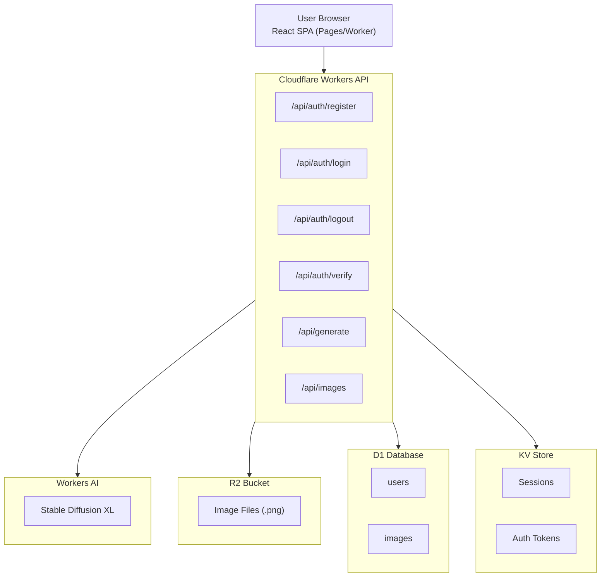
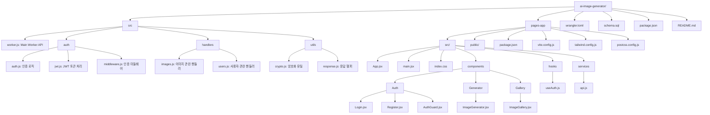

# Immerse Seoul 2025
- You only need Cloudflare resources to build an full-stack applications!

# System Architecture




# Project Tree 



You can also view the directory structure in text format:

```
ai-image-generator/
├── src/
│   ├── worker.js              # Main Worker API
│   ├── auth/
│   │   ├── auth.js           # 인증 로직
│   │   ├── jwt.js            # JWT 토큰 처리
│   │   └── middleware.js     # 인증 미들웨어
│   ├── handlers/
│   │   ├── images.js         # 이미지 관련 핸들러
│   │   └── users.js          # 사용자 관련 핸들러
│   └── utils/
│       ├── crypto.js         # 암호화 유틸
│       └── response.js       # 응답 헬퍼
├── pages-app/                 # React Frontend
│   ├── src/
│   │   ├── App.jsx           
│   │   ├── main.jsx          
│   │   ├── index.css         
│   │   ├── components/
│   │   │   ├── Auth/
│   │   │   │   ├── Login.jsx
│   │   │   │   ├── Register.jsx
│   │   │   │   └── AuthGuard.jsx
│   │   │   ├── Generator/
│   │   │   │   └── ImageGenerator.jsx
│   │   │   └── Gallery/
│   │   │       └── ImageGallery.jsx
│   │   ├── hooks/
│   │   │   └── useAuth.js
│   │   └── services/
│   │       └── api.js
│   ├── public/
│   ├── package.json
│   ├── vite.config.js
│   ├── tailwind.config.js
│   └── postcss.config.js
├── wrangler.toml             
├── schema.sql                
├── package.json              
└── README.md
```

# AI Image Generator with Authentication

A full-stack AI image generation application built with Cloudflare Workers, Workers AI, and React.

## Features

- 🎨 AI-powered image generation using Stable Diffusion XL
- 🔐 User authentication with JWT tokens
- 📊 Rate limiting (10 images per day per user)
- 🌐 Public/private image gallery
- 💾 Image storage in R2
- 📱 Responsive React frontend

## Setup

### Prerequisites

- Node.js 16+
- Cloudflare account
- Wrangler CLI installed

## Installation

```bash
make install
make db-init
make secrets

make init-pages
make deploy-pages
```
