# Immerse Seoul 2025
AI-powered image generation platform built entirely with Cloudflare's edge computing stack. Generate stunning images using AI while learning full-stack development with modern serverless architecture.

## 🚀 Features
- **AI Image Generation**: Powered by Stable Diffusion XL via Workers AI
- **User Authentication**: JWT-based auth with email verification
- **Image Management**: Upload, view, and delete generated images
- **Real-time Gallery**: Browse public and private image collections
- **Responsive UI**: Modern React SPA with Tailwind CSS
- **Edge Computing**: 100% serverless architecture on Cloudflare

## 🏗️ System Architecture


## 📁 Project Structure

```mermaid
graph TD
    root[📂 immerse-seoul/] --> config
    root --> backend
    root --> frontend
    root --> docs
    
    subgraph config[⚙️ Configuration]
        wrangler[wrangler.jsonc<br/>Worker Config]
        schema[schema.sql<br/>Database Schema]
        package[package.json<br/>Dependencies]
        vscode[.vscode/<br/>IDE Settings]
    end
    
    subgraph backend[🔧 Backend - Cloudflare Worker]
        src[src/] --> workers[workers.js<br/>Main Entry Point]
        src --> auth_dir[auth/]
        src --> handlers_dir[handlers/]
        src --> utils_dir[utils/]
        
        auth_dir --> auth_files[auth.js<br/>jwt.js<br/>middleware.js<br/>legacy-auth.js]
        handlers_dir --> handler_files[images.js<br/>user.js]
        utils_dir --> util_files[crypto.js<br/>email.js<br/>response.js]
    end
    
    subgraph frontend[🎨 Frontend - React SPA]
        pages[pages-app/] --> pages_src[src/]
        pages --> pages_config[Config Files]
        
        pages_src --> app[App.jsx<br/>Main Component]
        pages_src --> components[components/<br/>UI Components]
        pages_src --> hooks[hooks/<br/>Custom Hooks]
        pages_src --> services[services/<br/>API Client]
        
        pages_config --> vite[vite.config.js]
        pages_config --> tailwind[tailwind.config.js]
        pages_config --> postcss[postcss.config.js]
        pages_config --> pages_package[package.json]
    end
    
    subgraph docs[📚 Documentation & Testing]
        readme[README.md]
        test_dir[test/<br/>Test Files]
        makefile[Makefile<br/>Build Scripts]
    end
    
    style backend fill:#ffe6cc
    style frontend fill:#e6f3ff
    style config fill:#f0f0f0
    style docs fill:#e6ffe6
```



## 🛠️ Installation & Setup

### Prerequisites

Before you begin, ensure you have the following installed:

- **Node.js 18+** - [Download here](https://nodejs.org/)
- **Cloudflare Account** - [Sign up for free](https://dash.cloudflare.com/sign-up)
- **Wrangler CLI** - Cloudflare's command-line tool

```bash
npm install -g wrangler
```

### 1. Clone and Setup Project

```bash
# Clone the repository
git clone <repository-url>
cd immerse-seoul

# Install backend dependencies
npm install

# Install frontend dependencies
cd pages-app
npm install
cd ..
```

### 2. Cloudflare Authentication

```bash
# Login to Cloudflare
wrangler auth login

# Verify authentication
wrangler whoami
```

### 3. Create Cloudflare Resources

#### D1 Database
```bash
# Create D1 database
wrangler d1 create image-metadata-auth

# Initialize database with schema
wrangler d1 execute image-metadata-auth --file=./schema.sql
```

#### R2 Storage Bucket
```bash
# Create R2 bucket for image storage
wrangler r2 bucket create ai-generated-images-auth
```

#### KV Namespace
```bash
# Create KV namespace for sessions
wrangler kv:namespace create "SESSIONS"
```

### 4. Configure Environment Variables

Update `wrangler.jsonc` with your resource IDs:

```jsonc
{
  "d1_databases": [
    {
      "binding": "DB",
      "database_name": "image-metadata-auth",
      "database_id": "YOUR_D1_DATABASE_ID" // Replace with actual ID
    }
  ],
  "kv_namespaces": [
    {
      "binding": "SESSIONS",
      "id": "YOUR_KV_NAMESPACE_ID" // Replace with actual ID
    }
  ]
}
```

Set up secrets:
```bash
# Generate and set JWT secret (use a strong random string)
wrangler secret put JWT_SECRET

# Set email service secret (if using email verification)
wrangler secret put RESEND_API_KEY
```

### 5. Deploy Backend (Cloudflare Worker)

```bash
# Deploy the worker using your local configuration
wrangler deploy --config wrangler.local.jsonc

# Note the worker URL from output (e.g., https://immerse-seoul.your-subdomain.workers.dev)
# Test the deployment
curl https://immerse-seoul.your-subdomain.workers.dev/api/test
```

> **Note**: Use `wrangler.local.jsonc` for deployment (contains real IDs). The `wrangler.jsonc` file has placeholders for GitHub safety.

### 6. Deploy Frontend (Cloudflare Pages)

```bash
cd pages-app

# Build the frontend
npm run build

# Deploy to Cloudflare Pages
wrangler pages deploy dist --project-name=immerse-seoul-frontend
```

### 7. Configure Custom Domains (Optional)

Set up custom domains in your Cloudflare dashboard:
- **API**: `immerse-seoul-api.metamon.shop` → Worker
- **Frontend**: `immerse-seoul.metamon.shop` → Pages

## 🌐 API Endpoints

### Authentication
- `POST /api/auth/register` - User registration
- `POST /api/auth/login` - User login
- `POST /api/auth/logout` - User logout
- `GET /api/auth/verify` - Verify JWT token
- `GET /api/auth/verify-email` - Email verification

### Image Generation & Management
- `POST /api/generate` - Generate AI image (authenticated)
- `GET /api/images` - Get public images
- `GET /api/user/images` - Get user's images (authenticated)
- `GET /api/image/{id}` - Get specific image
- `POST /api/image/delete` - Delete image (authenticated)

### System
- `GET /api/test` - Health check and system info

## 🔒 Environment Variables

Required environment variables in `wrangler.jsonc`:

```jsonc
{
  "vars": {
    "SESSION_DURATION": "86400",     // Session duration in seconds
    "DAILY_IMAGE_LIMIT": "10",       // Daily image generation limit
    "ENVIRONMENT": "production",      // Environment mode
    "EMAIL_FROM": "your-email@domain.com" // Email sender address
  }
}
```

Required secrets (set via `wrangler secret put`):
- `JWT_SECRET` - Secret key for JWT token signing
- `RESEND_API_KEY` - API key for email service (optional)

## 📚 Learn More

- [Cloudflare Workers Documentation](https://developers.cloudflare.com/workers/)
- [Workers AI Documentation](https://developers.cloudflare.com/workers-ai/)
- [Cloudflare Pages Documentation](https://developers.cloudflare.com/pages/)
- [D1 Database Documentation](https://developers.cloudflare.com/d1/)
- [R2 Storage Documentation](https://developers.cloudflare.com/r2/)
